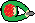
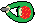
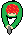

<!DOCTYPE html>
<html>
    <meta charset="utf-8"> 
	<head>
		<title>Duluku</title>
		<link rel="stylesheet" href="main.css">
	</head>
	<body onload="startGame()">
		<header>
			<nav>
				<h1>Duluku</h1>
				<ul>
					<li><a href="index.html">Main</a></li>
					<li><a href="me.html">About</a></li>
					<li><a href="data.html">Data</a></li>
					<li></li>
				</ul>
			</nav>
		</header>
        

            <meta name="viewport" content="width=device-width, initial-scale=1.0"/>
            
            
             
            
            
            
            
        

		<footer class="foot">Copyright 2016 Duluku</footer>
	</body>
</html>
